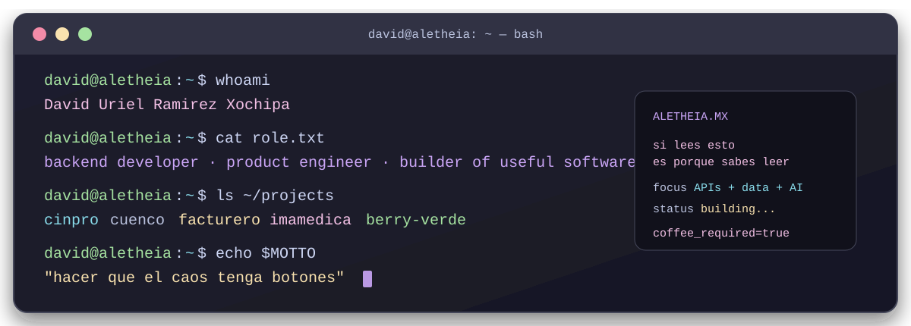

<p align="center">
  
</p>

```console
david@aletheia:~$ whoami
David Uriel Ramirez Xochipa

david@aletheia:~$ cat role.txt
backend developer · product engineer · constructor de cosas útiles

david@aletheia:~$ cat about.md
Me gusta el backend, pero me obsesiona que el producto tenga sentido para
quien lo usa. Si hay un proceso manual, una regla escondida en Excel o un
sistema que se cae cuando llega el caso raro, probablemente ahí empieza
mi diversión.
```

> **Mi especialidad:** convertir “necesitamos algo para esto” en una aplicación que alguien pueda usar el lunes por la mañana.

## `./mission` ⚙️

<table>
  <tr>
    <td width="50%" valign="top">
      <h3>backend con propósito</h3>
      <p>APIs que entienden el negocio, reglas que no se esconden y servicios que pueden crecer sin volverse una leyenda urbana.</p>
      <p><code>REST</code> <code>microservices</code> <code>business rules</code></p>
    </td>
    <td width="50%" valign="top">
      <h3>producto que no pelea</h3>
      <p>Flujos claros, permisos razonables, errores recuperables y pantallas que no obligan a la persona a pensar como la máquina.</p>
      <p><code>UX</code> <code>flows</code> <code>reliability</code></p>
    </td>
  </tr>
  <tr>
    <td width="50%" valign="top">
      <h3>datos que cuentan</h3>
      <p>SQL, NoSQL, migraciones, OCR, reportes y dashboards para que la operación deje de depender de adivinar.</p>
      <p><code>PostgreSQL</code> <code>MySQL</code> <code>OCR</code></p>
    </td>
    <td width="50%" valign="top">
      <h3>sistemas que hablan</h3>
      <p>SAT/CFDI, Facturapi, pagos, WhatsApp/Meta, Telegram y las integraciones que hacen que un negocio avance.</p>
      <p><code>integrations</code> <code>webhooks</code> <code>automation</code></p>
    </td>
  </tr>
</table>

<p align="center"><sub>En Aletheia construyo software con IA para problemas reales de negocios, escuelas y equipos.</sub></p>

## `ls ~/projects` 🧰

<p><sub>Proyectos donde el código se encuentra con la operación diaria.</sub></p>

| proyecto | misión | zona de juego |
| :--- | :--- | :--- |
| `cinpro/` | facturación electrónica, CFDI, SAT y operación contable | <code>billing</code> <code>OCR</code> |
| `cuenco/` | reservas, calendarios, disciplinas e instructores | <code>booking</code> <code>calendar</code> |
| `facturero/` | portal de facturación, pagos y reglas de negocio | <code>payments</code> <code>portal</code> |
| `imamedica/` | plantillas Meta, catálogos y operación médica | <code>WhatsApp</code> <code>catalogs</code> |
| `casa-x-raiz/` | proyectos, documentos, pagos y automatizaciones con IA | <code>AI</code> <code>Telegram</code> |
| `berry-verde/` | inventario, caja, ventas, merma e impresión | <code>POS</code> <code>reports</code> |
| `aura/` | aprendizaje digital, lecciones, juegos y progreso | <code>education</code> <code>games</code> |

<details>
  <summary><strong>🧭 stack que aparece cuando abro la terminal</strong></summary>
  <br />
  <p>
    <code>Go</code> <code>Python</code> <code>TypeScript</code> <code>Next.js</code>
    <code>Django</code> <code>FastAPI</code> <code>PostgreSQL</code> <code>Docker</code>
    <code>OpenAPI</code> <code>Playwright</code>
  </p>
</details>

## `git log --oneline --all` 🧭

<p><em>No aparecí ayer con un framework de moda.</em></p>

| commit | era | lo que aprendí construyendo |
| :---: | :--- | :--- |
| `01` | **C/C++ · OpenGL** | curvas Bézier, triángulos, líneas y paciencia visual |
| `02` | **Java · Linux** | sistemas distribuidos y sistemas operativos |
| `03` | **Dart · Flutter** | prototipos móviles y proyectos de bienestar |
| `04` | **Go · Python · TypeScript** | APIs, microservicios e IA aplicada |

<p align="center"><code>curiosidad → sistemas → producto → software útil</code></p>

<details>
  <summary>🗃️ Abrir la carpeta arqueológica</summary>

  <br />
  Mi versión <code>x0chipa</code> sigue por aquí: <a href="https://github.com/x0chipa">github.com/x0chipa</a>.
  Ahí quedaron algunos fósiles queridos de C++, Java, Dart, OpenGL y mis primeros experimentos de producto.
</details>

## `neofetch` 🛠️

<p align="center">
  
</p>

## `cat ~/.config/principles` 💡

<blockquote>
  <p><strong>El software no debería pedirle a la persona que piense como la máquina.</strong></p>
  <p><sub>Si lo hace, todavía nos falta diseño.</sub></p>
</blockquote>

<table>
  <tr>
    <td><strong>01 · claridad</strong><br /><sub>flujos que se entienden</sub></td>
    <td><strong>02 · criterio</strong><br /><sub>automatizar lo que sí conviene</sub></td>
    <td><strong>03 · cuidado</strong><br /><sub>el caso raro también existe</sub></td>
  </tr>
</table>

```console
david@aletheia:~$ echo $MOTTO
"hacer que el caos tenga botones"

david@aletheia:~$ ./current-build
Construyendo software de negocio y evitando que el caso raro llegue
a producción a las 5:59 pm.

david@aletheia:~$ exit
coffee_required=true
```

<p align="center">
  <a href="https://aletheia.mx/"><strong>Conoce Aletheia Solutions →</strong></a>
  <br />
  <sub>Software útil, terminal bonita y café suficiente ☕</sub>
</p>
