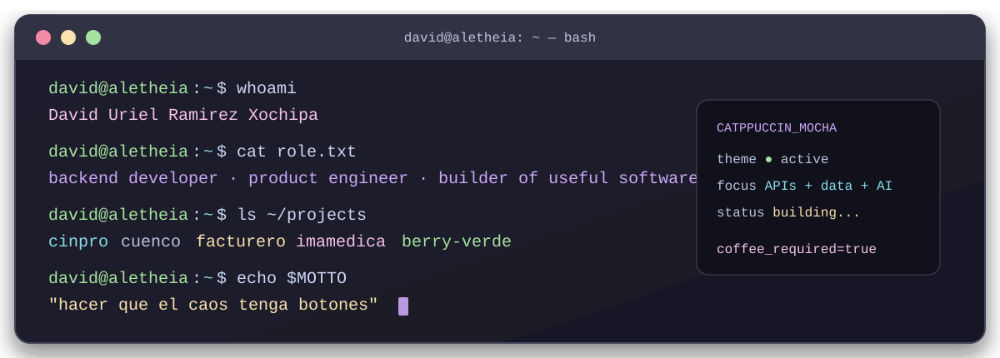

<p align="center">
  
</p>

<p align="center">
  <a href="https://aletheia.mx/"><strong>aletheia.mx</strong></a>
  · <a href="https://github.com/x0chipa">archivo histórico</a>
  · theme: <code>catppuccin-mocha</code>
</p>

```console
david@aletheia:~$ whoami
David Uriel Ramirez Xochipa

david@aletheia:~$ cat role.txt
backend developer · product engineer · constructor de cosas útiles

david@aletheia:~$ cat about.md
Me gusta el backend, pero me obsesiona que el producto tenga sentido para
quien lo usa. Si hay un proceso manual, una regla escondida en Excel o un
sistema que se cae cuando llega el caso raro, probablemente ahí empieza
mi diversión.
```

> **Mi especialidad:** convertir “necesitamos algo para esto” en una aplicación que alguien pueda usar el lunes por la mañana.

## `./mission` ⚙️

En **Aletheia** construyo software con IA para problemas reales: APIs, datos, integraciones y productos que ayudan a negocios, escuelas y equipos a operar mejor.

```text
┌─ backend con propósito ─────────────────────────────────────────────┐
│ APIs RESTful · reglas de negocio · servicios · microservicios        │
├─ datos que cuentan una historia ────────────────────────────────────┤
│ SQL · NoSQL · migraciones · dashboards · OCR · reportes              │
├─ sistemas que hablan ────────────────────────────────────────────────┤
│ SAT/CFDI · Facturapi · pagos · WhatsApp/Meta · Telegram              │
└─ producto que no pelea ──────────────────────────────────────────────┘
  flujos claros · permisos · errores recuperables · pantallas humanas
```

## `ls ~/projects` 🧰

```console
cinpro/       facturación electrónica, CFDI, SAT y operación contable
cuenco/       reservas, calendarios, disciplinas e instructores
facturero/    portal de facturación, pagos y reglas de negocio
imamedica/    plantillas Meta, catálogos y herramientas de operación médica
casa-x-raiz/  proyectos, documentos, pagos y automatizaciones con IA
berry-verde/  inventario, caja, ventas, merma e impresión
aura/         aprendizaje digital, lecciones, juegos y progreso
```

## `git log --oneline --all` 🧭

No aparecí ayer con un framework de moda.

```text
era 01  C/C++ · OpenGL · curvas Bézier · triángulos · líneas
era 02  Java · Linux · sistemas distribuidos · sistemas operativos
era 03  Dart/Flutter · prototipos móviles · proyectos de bienestar
era 04  Go · Python · TypeScript · APIs · microservicios · IA aplicada
```

<details>
  <summary>🗃️ Abrir la carpeta arqueológica</summary>

  Mi versión `x0chipa` sigue por aquí: [github.com/x0chipa](https://github.com/x0chipa). Ahí quedaron algunos fósiles queridos de C++, Java, Dart, OpenGL y mis primeros experimentos de producto.
</details>

## `neofetch` 🛠️

```text
OS        Aletheia / México
Shell     curioso, directo y ligeramente obsesionado con los detalles
Focus     backend · producto · integraciones · IA
Stack     Go · Python · TypeScript · Next.js · Django · FastAPI
Data      PostgreSQL · MySQL · SQL · NoSQL
Infra     Docker · GitHub Actions · Playwright · OpenAPI
Mood      Catppuccin Mocha · café · bugs con nombre
```

## `cat ~/.config/principles` 💡

> El software no debería pedirle a la persona que piense como la máquina. Si lo hace, todavía nos falta diseño.

```console
david@aletheia:~$ echo $MOTTO
"hacer que el caos tenga botones"

david@aletheia:~$ ./current-build
Construyendo software de negocio y evitando que el caso raro llegue
a producción a las 5:59 pm.

david@aletheia:~$ exit
coffee_required=true
```

<p align="center">
  <a href="https://aletheia.mx/"><strong>Conoce Aletheia Solutions →</strong></a>
  <br />
  <sub>Software útil, terminal bonita y café suficiente ☕</sub>
</p>
